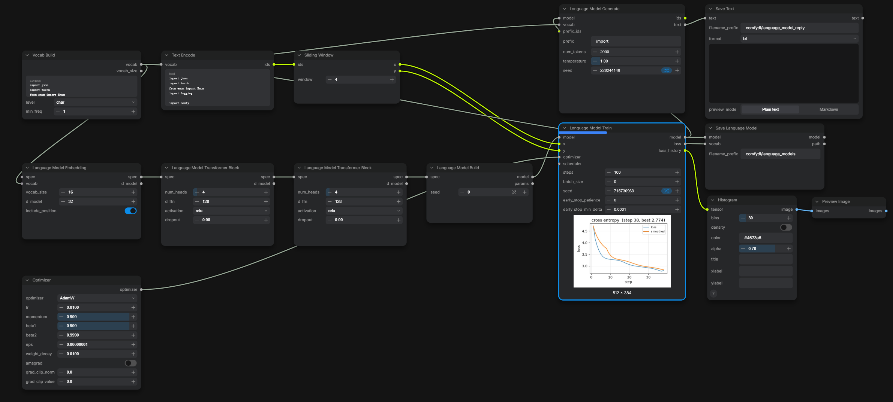
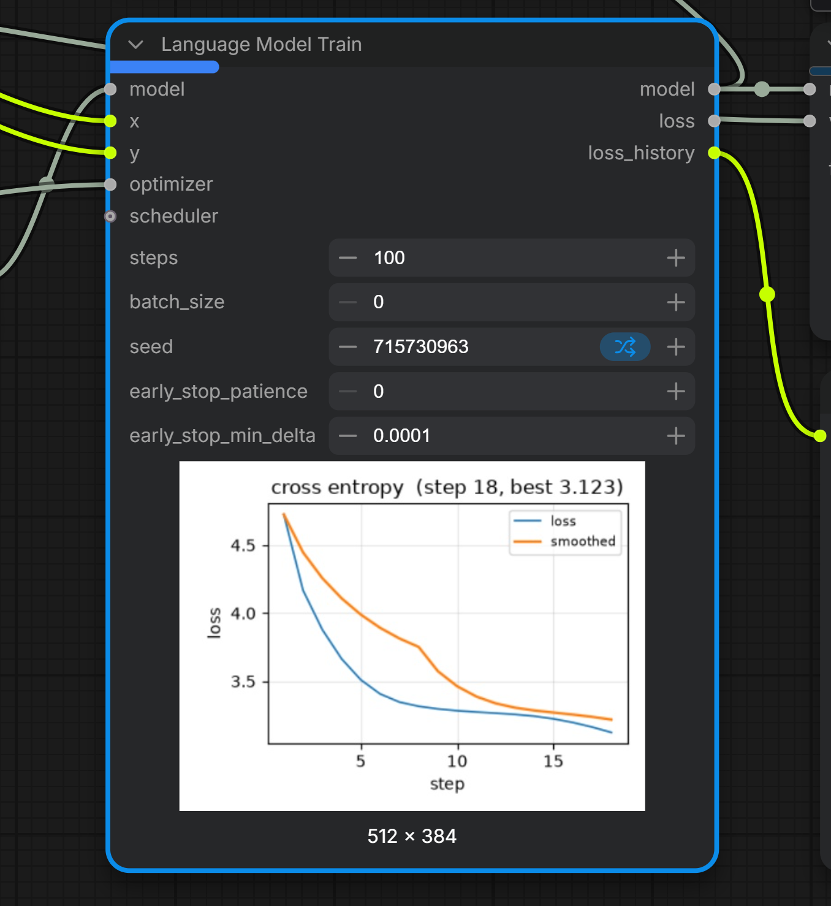
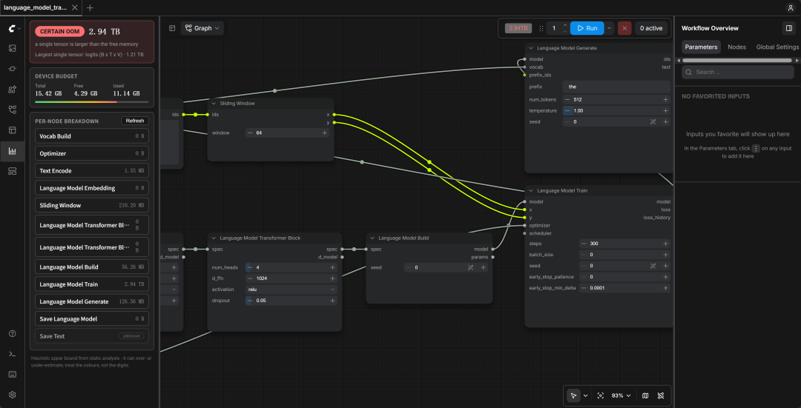
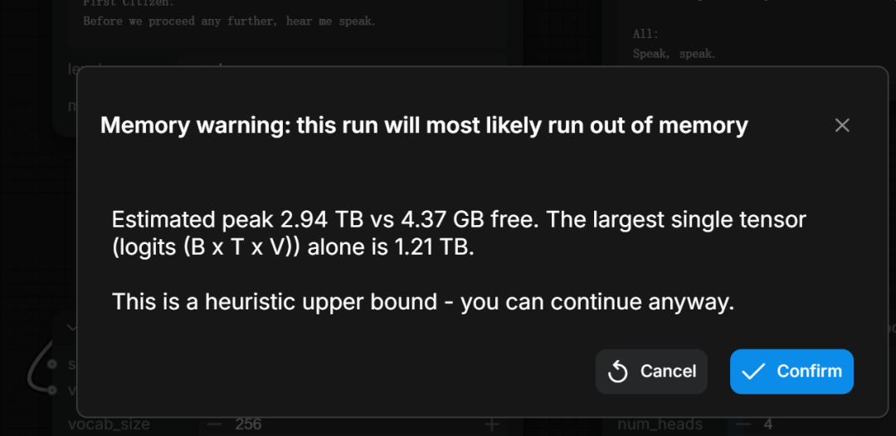

<div align="center">

# ComfyDL_UI

**Deep Learning is just a few clicks away!**

The GUI build of [ComfyDL](https://github.com/Cynthia-lxx/ComfyDL) — a deep-learning-focused
fork of ComfyUI.

</div>

## What's This?

`ComfyDL_UI` lets you build deep learning workflows — from CNNs to language models — by
connecting nodes in a graph, not by writing code. It hosts the
[ComfyDL](https://github.com/Cynthia-lxx/ComfyDL) node pack as a built-in set of nodes
(tensors, layers, optimizers, training loops, NLP pipelines, data utilities and
visualizations) on top of a trimmed ComfyUI runtime.

It is **not** the complete original ComfyUI: this repository is a dehydrated fork
(see [`docs/dehydrate_manifest.md`](docs/dehydrate_manifest.md)) that keeps the node-graph
engine, server and basic image IO, and drops the diffusion-generation stack. If you want the
original ComfyUI, get it from <https://github.com/comfyanonymous/ComfyUI>.

## What it looks like

A language model trained end to end inside the graph — Vocab Build → Text Encode → Sliding
Window → the Language Model pipeline → Generate → Save. The `Language Model Train` node streams
its cross-entropy curve **under itself while it trains** (the preview card below the node):



<p align="center">
  
</p>

> More examples and the complete node reference live in the [`comfydl/`](comfydl/) submodule
> README ([中文](comfydl/README_zh.md), [FUNCTIONS.md](comfydl/FUNCTIONS.md)).

## Features

- A visual node graph for building and reusing deep-learning workflows without code.
- The full [ComfyDL](https://github.com/Cynthia-lxx/ComfyDL) node pack built in: tensor ops,
  network layers, learnable parameters, optimizers, training loops with live loss-curve
  previews, language-model training and generation, datasets, and visualization nodes.
- Efficient local execution with asynchronous queueing and partial graph re-execution — only
  the parts of the graph that changed are re-run.
- Smart VRAM/RAM management with automatic CPU fallback when no GPU backend is available.
- Live progress and preview cards under running nodes (loss curves, generated text snapshots),
  streamed over the built-in WebSocket channel.
- Built-in memory profiling: peak-memory estimation, traffic-light verdicts, a warning before
  queueing a graph that cannot fit, and post-mortem analysis of failed allocations.
- Workflows are saved and loaded as JSON.
- Runs fully offline: the core downloads nothing unless you ask it to.
- Still compatible with third-party custom nodes via `custom_nodes/`.
- Configure additional model locations with [`extra_model_paths.yaml`](extra_model_paths.yaml.example).

### Memory profiling

Before anything is queued, ComfyDL_UI estimates the graph's peak memory from its parameters and
data flow, grades it green / amber / red against the device budget, and warns before a run that
cannot fit.



- **Estimates while you edit** — re-estimated after a 500 ms debounce; the sidebar shows the budget, estimated peak, largest single tensor, and a per-node breakdown (params / activations / optimizer state).
- **Traffic-light verdict** — green fits; amber is tight (a toast); red is **certain OOM** and warns before running.
- **Post-mortem analysis** — a failed allocation's byte count is matched back to its tensor, with a suggested value that fits.
- **Honest about unknowns** — uncovered node types are reported as `unknown`.
- **Bilingual** — panel, badge, dialog and post-mortem card follow the UI language.

Pressing Run on a red graph warns first and can be overridden:

<p align="center">
  
</p>

Formulas, thresholds and the acceptance checklist live in
[`docs/profiling-m1-memory-estimation.md`](docs/profiling-m1-memory-estimation.md).

## Installation

Requires Python 3.12+ (3.13 recommended). Any OS with a supported PyTorch build works.

First create a virtual environment to keep the dependencies isolated — this avoids conflicts
with packages installed elsewhere on your machine:

```bash
git clone https://github.com/Cynthia-lxx/ComfyDL_UI
cd ComfyDL_UI
python -m venv .venv

.venv\Scripts\activate     # Windows
source .venv/bin/activate  # Linux / macOS
```

Then install the dependencies and launch:

```bash
pip install -r requirements.txt
python main.py
```

Open the address it prints. The ComfyDL nodes are already registered as built-ins — nothing
goes into `custom_nodes`.

### GPU acceleration

A CPU-only machine works out of the box. For GPU acceleration, install the PyTorch build that
matches your hardware into the same environment:

- **NVIDIA**: `pip install torch torchvision torchaudio --extra-index-url https://download.pytorch.org/whl/cu130`
- **AMD (Linux, ROCm)**: `pip install torch torchvision torchaudio --index-url https://download.pytorch.org/whl/rocm7.2`
- **Intel Arc**: `pip install torch torchvision torchaudio --index-url https://download.pytorch.org/whl/xpu`
- **Apple Silicon**: follow the [Accelerated PyTorch training on Mac](https://developer.apple.com/metal/pytorch/) guide.

If you get "Torch not compiled with CUDA enabled", `pip uninstall torch` and reinstall with the
matching command above.

## Running

```bash
python main.py
```

Useful flags (see `python main.py --help` for all of them):

- `--cpu` — force CPU execution.
- `--port 8188` — change the listening port.
- `--tls-keyfile key.pem --tls-certfile cert.pem` — serve over HTTPS instead of HTTP.

On AMD cards not officially covered by ROCm, try `HSA_OVERRIDE_GFX_VERSION=10.3.0 python main.py`
(RDNA2 and older) or `HSA_OVERRIDE_GFX_VERSION=11.0.0` (RDNA3).

### Notes

- Only parts of the graph whose outputs have all their inputs are executed, and re-submitting
  an unchanged graph re-runs only the parts that changed.
- Dragging a generated PNG onto the page loads the workflow (including seeds) that produced it.

## Keyboard shortcuts

| Keybind                            | Explanation                                                                                                        |
|------------------------------------|--------------------------------------------------------------------------------------------------------------------|
| `Ctrl` + `Enter`                      | Queue up current graph for generation                                                                              |
| `Ctrl` + `Shift` + `Enter`              | Queue up current graph as first for generation                                                                     |
| `Ctrl` + `Alt` + `Enter`                | Cancel current generation                                                                                          |
| `Ctrl` + `Z`/`Ctrl` + `Y`                 | Undo/Redo                                                                                                          |
| `Ctrl` + `S`                          | Save workflow                                                                                                      |
| `Ctrl` + `O`                          | Load workflow                                                                                                      |
| `Ctrl` + `A`                          | Select all nodes                                                                                                   |
| `Alt `+ `C`                           | Collapse/uncollapse selected nodes                                                                                 |
| `Ctrl` + `M`                          | Mute/unmute selected nodes                                                                                         |
| `Ctrl` + `B`                           | Bypass selected nodes (acts like the node was removed from the graph and the wires reconnected through)            |
| `Delete`/`Backspace`                   | Delete selected nodes                                                                                              |
| `Ctrl` + `Backspace`                   | Delete the current graph                                                                                           |
| `Space`                              | Move the canvas around when held and moving the cursor                                                             |
| `Ctrl`/`Shift` + `Click`                 | Add clicked node to selection                                                                                      |
| `Ctrl` + `C`/`Ctrl` + `V`                  | Copy and paste selected nodes (without maintaining connections to outputs of unselected nodes)                     |
| `Ctrl` + `C`/`Ctrl` + `Shift` + `V`          | Copy and paste selected nodes (maintaining connections from outputs of selected nodes to inputs of pasted nodes)   |
| `Shift` + `Drag`                       | Move multiple selected nodes at the same time                                                                      |
| `Ctrl` + `D`                           | Load default graph                                                                                                 |
| `Alt` + `+`                          | Canvas Zoom in                                                                                                     |
| `Alt` + `-`                          | Canvas Zoom out                                                                                                    |
| `Ctrl` + `Shift` + LMB + Vertical drag | Canvas Zoom in/out                                                                                                 |
| `P`                                  | Pin/Unpin selected nodes                                                                                           |
| `Ctrl` + `G`                           | Group selected nodes                                                                                               |
| `Q`                                 | Toggle visibility of the queue                                                                                     |
| `H`                                  | Toggle visibility of history                                                                                       |
| `R`                                  | Refresh graph                                                                                                      |
| `F`                                  | Show/Hide menu                                                                                                      |
| `.`                                  | Fit view to selection (Whole graph when nothing is selected)                                                        |
| Double-Click LMB                   | Open node quick search palette                                                                                     |
| `Shift` + Drag                       | Move multiple wires at once                                                                                        |
| `Ctrl` + `Alt` + LMB                   | Disconnect all wires from clicked slot                                                                             |

`Ctrl` can also be replaced with `Cmd` instead for macOS users.

## Documentation

- [`comfydl/`](comfydl/) — the node pack: `README.md` / `README_zh.md` and the complete node
  references `FUNCTIONS.md` / `FUNCTIONS_zh.md`.
- [`docs/`](docs/) — fork-specific notes: dehydration manifest, branding, built-in node pack,
  memory profiling, and the step-by-step reform design documents.
- [`AGENTS.md`](AGENTS.md) — how this repository is worked on.
- [中文说明](README_zh.md)

## Version and credits

- **Version** — `v0.3.1`, dehydrated from ComfyUI `v0.34.0`.
- **Maintainer** — [Cynthia-lxx](https://github.com/Cynthia-lxx).
- **License** — GPL-3.0, for this repository and the `comfydl/` submodule
  ([`LICENSE`](LICENSE), [`comfydl/LICENSE`](comfydl/LICENSE)).

This project is derived from [ComfyUI](https://github.com/comfyanonymous/ComfyUI) by
comfyanonymous and contributors. Upstream ComfyUI keeps its own copyright and maintainers; both
notices are listed at the end of [`LICENSE`](LICENSE). The upstream project's website, docs and
community live at <https://www.comfy.org/> and are maintained separately from ComfyDL_UI.
